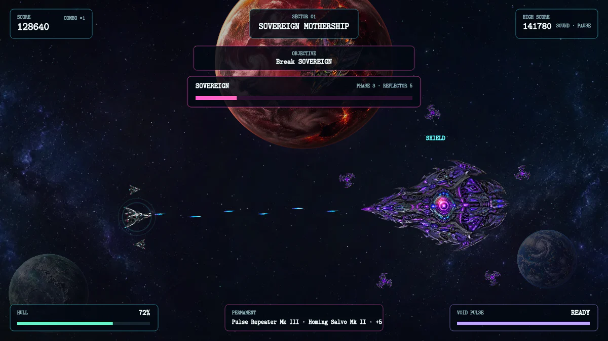

# Neon Voyage

**Version v2026.8.21f** · [MIT License](LICENSE)

Neon Voyage is a fast, finite-arena space shooter about leaving Earth, crossing a dangerous asteroid frontier, and surviving first contact with an alien fleet.

## [▶ Play Neon Voyage in your browser](https://xenovoyage.github.io/Neon-Voyage/)

## At a glance

| Detail | Summary |
| --- | --- |
| Genre | 2D space arcade shooter |
| Journey | Twenty stages, with command-ship battles at Stages 10, 15, and 20 |
| Play with | Keyboard and mouse, gamepad, or touch controls |
| Progress | Local stage checkpoints with saved, stacking weapon loadouts |
| Built with | HTML, CSS, JavaScript, and Canvas |

## How to play

| Action | Keyboard and mouse | Gamepad or touch |
| --- | --- | --- |
| Move | `WASD` or arrows | Left stick |
| Aim | Mouse or `I J K L` | Right stick |
| Fire | Click or `Space` | Primary / aim stick |
| Dash | `Shift` | Secondary / Dash |
| Void Pulse | `E` | Tertiary / Pulse |
| Pause | `P` or `Esc` | Menu / Pause |

On phones and tablets, play in landscape and touch either half of the battlefield to place its movement or aim stick. The larger floating sticks follow each thumb when it moves beyond their radius. Drag the aim stick for manual fire, or hold it still briefly to target the nearest threat; Dash and Pulse appear only while ready. Compact touch layouts condense owned systems and active timers into readable summary chips so the controls stay clear.

## The voyage

Clear each battlefield, stack long-lasting temporary weapons, and grow a stage-gated catalog of 13 permanent modules through Mk V. Reward chances and tier limits rise as the voyage becomes more dangerous. **Enigma** signals slow combat to a halt and offer three compact animated enhancement cards, while ten milestone clears guarantee key systems.

The voyage escalates across twenty authored stages. First contact begins at Stage 3, the Titan Gate breaks at Stage 5, and three distinct command ships anchor the campaign: the Harrower at Stage 10, the reflective Leviathan at Stage 15, and the giant Sovereign mothership at Stage 20. Crystal asteroids burst into short-lived hostile shards; Colossal, Titan, and Auric masses break through finite descendant trees; and Coronas, Gunships, and Brood Carriers add readable late-game counterplay. Alien contacts are intentionally fewer but durable: their biomechanical silhouettes show smoke and internal fire as hull integrity falls, while carrier child ceilings prevent clutter. Auric descendants inherit their parent's drift and separate gradually rather than exploding into fast, ship-like shards. Void Pulse pulls nearby asteroids inward without moving alien ships, while frequent longer-lived upgrades—including the turbine-shaped Overdrive pickup and Thruster Surge—bring autonomous fire and build variety online early. A genuinely cleared field salvages remaining beneficial pickups before travel, with every Enigma still requiring its normal choice. Every stage occupies a larger finite field with restrained camera follow, hard boundaries, and clustered edge cues that reuse real target art. **New Game** begins again at Earth; **Continue** restores the selected checkpoint's saved weapons to a fresh battlefield.

Every ship, asteroid, projectile, pickup, and impact now shares one realistic deep-space art direction. Raster-backed craft use attached gradient exhaust and soft state auras rather than old procedural line decoration; locally synthesized weapon, material-impact, and destruction cues start at an 80% master level and can be adjusted from 0–100% in Settings. Camera shake and full-screen flashes are independent, persistent options that start off.

## Run locally

Download or clone the repository, then open `index.html` in a modern browser. No installation or build step is needed.

## Project documentation

- [Game design](docs/GAME_DESIGN.md)
- [Architecture](docs/ARCHITECTURE.md)
- [Current status](docs/STATUS.md)
- [Contributing](CONTRIBUTING.md)
- [Security](SECURITY.md)
- [Changelog](CHANGELOG.md) and [source audit](AUDIT.md)

Designed and implemented with **OpenAI Codex**, with gameplay direction and review from **XenoVoyage**. Released under the [MIT License](LICENSE).
