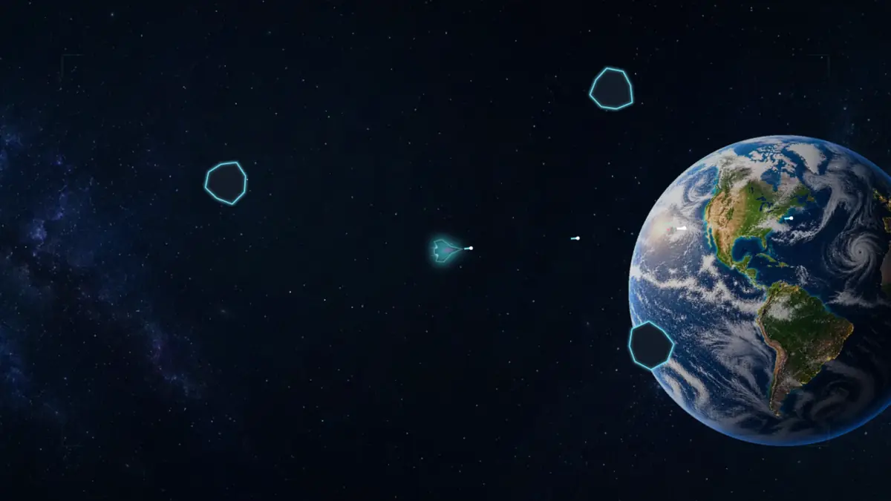
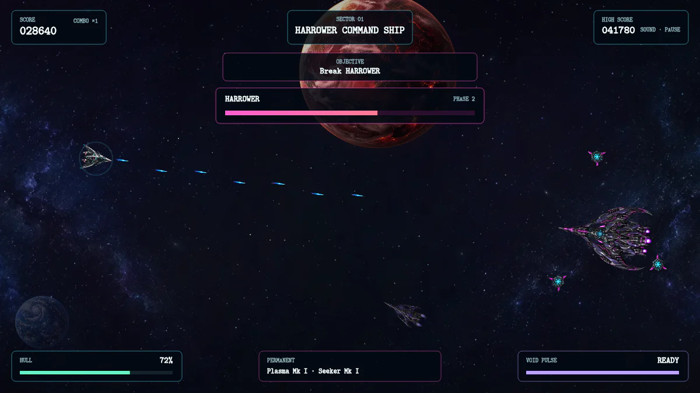

# Neon Voyage

Neon Voyage is a fast, fixed-screen space shooter about leaving Earth, crossing a dangerous asteroid frontier, and surviving first contact with an alien fleet.

## [Play Neon Voyage](https://xenovoyage.github.io/Neon-Voyage/)

## At a glance

| Detail | Summary |
| --- | --- |
| Genre | 2D space arcade shooter |
| Journey | Nine stages, from Earth Orbit to the Harrower command ship |
| Play with | Keyboard and mouse, gamepad, or touch controls |
| Progress | Local stage checkpoints with saved weapon loadouts |
| Built with | HTML, CSS, JavaScript, and Canvas |

## How to play

| Action | Keyboard and mouse | Gamepad or touch |
| --- | --- | --- |
| Move | `WASD` or arrows | Left stick |
| Aim | Mouse or `I J K L` | Right stick |
| Fire | Click or `Space` | Primary / aim stick |
| Dash | `Shift` | Secondary / Dash |
| Void Pulse | `E` | Tertiary / Pulse |
| Pause | `P` or `Esc` | Menu / Pause |

On phones and tablets, play in landscape and touch either half of the battlefield to place its movement or aim stick.

## The voyage

Clear each battlefield, collect temporary weapons, install permanent modules, and travel deeper into unknown space. **New Game** begins again at Earth; **Continue** opens the stages you have earned and restores the saved weapons for the selected checkpoint.

## Run locally

Download or clone the repository, then open `index.html` in a modern browser. No installation or build step is needed.

Project details live in the [game design](docs/GAME_DESIGN.md), [changelog](CHANGELOG.md), [contributor guide](AGENTS.md), and [release audit](AUDIT.md).

Designed and implemented with **OpenAI Codex**, with gameplay direction and review from **XenoVoyage**. Released under the [MIT License](LICENSE).
