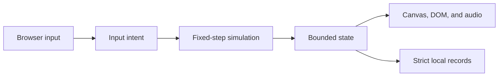

# Architecture

Neon Voyage is a static browser game built from one HTML document, one stylesheet, five deferred classic scripts, Canvas rendering, and Web Audio. It has no runtime package, module loader, server, network request, or build step.

## Startup and data flow

`index.html` loads scripts in this fixed order:

1. `js/config.js` creates the deeply frozen balance and stage configuration.
2. `js/core.js` exposes deterministic math, collision, storage, bounds, and collection utilities.
3. `js/audio.js` defines the capped optional Web Audio engine.
4. `js/render.js` defines authored scene data, previews, and the Canvas renderer.
5. `js/game.js` validates saved records, creates live state, binds input and UI, and starts the one animation loop.

Browser events write input intent. `js/game.js` consumes that intent in a 60 Hz fixed-step update with at most five catch-up steps per animation frame. The renderer reads the resulting state once per animation frame. Simulation state does not depend on render timing.

## Source ownership

| Source | Owns | Does not own |
| --- | --- | --- |
| `index.html` | Semantic shell, dialogs, HUD, controls, CSP, script order | Gameplay behavior or styling |
| `styles.css` | Responsive layout, overlays, touch presentation, focus, reduced-motion styling | Simulation state |
| `js/config.js` | Version, stages, balance, difficulty functions, dimensions, timing, caps | Mutable run state |
| `js/core.js` | Pure reusable deterministic utilities and safe storage primitives | Domain orchestration |
| `js/audio.js` | Optional synthesized cues and active-node cap | Gameplay decisions |
| `js/render.js` | Scene keyframes, asset loading, previews, Canvas drawing | Progression or collision outcomes |
| `js/game.js` | Saved progress, modes, input, encounters, combat, progression, UI projection, frame loop | Authored balance values or raster provenance |
| `tests/` | Deterministic contracts and dependency-free browser simulation | Human game-feel acceptance |

Exact product behavior belongs in [`GAME_DESIGN.md`](GAME_DESIGN.md); exact tuning and caps belong in `js/config.js`.

## State and persistence

`js/game.js` owns one plain-object live state. Entity collections are mutated only through the fixed-step path and cleaned against the caps in `CONFIG.caps`. Encounter queues carry required, optional, descendant, and hard-cull-requeued threats until the field is truly clear.

Two strict local-storage records are intentionally separate:

| Key | Contents | Compatibility rule |
| --- | --- | --- |
| `neon-voyage-v1` | High score and sound/effects preferences | Keep the key and strict validation |
| `neon-voyage-progress-v1` | Schema-2 unlocked stages and bounded per-stage weapon loadouts | Preserve schema-1 migration or add a tested migration |

Live hull, score, position, clocks, cooldown phase, entities, and paused battles are never saved as campaign checkpoints.

## Large-file routing

`js/game.js` is deliberately the orchestration owner. Inspect the connected region and its tests before changing it:

| Responsibility | Main functions or state |
| --- | --- |
| Save compatibility | `validSave`, checkpoint/progress validators, `saveLocal`, `saveProgress` |
| Modes and UI ownership | overlay/dialog helpers, run start/restart/menu flow, progress grid |
| Input lifecycle | keyboard, pointer, touch-stick, gamepad, orientation, visibility cleanup |
| Encounter lifecycle | combat-field setup, queues, waves, hyperspace, stage advancement |
| Combat | ship/weapons, spawns, threats, bosses, collisions, damage, pickups |
| Bounded cleanup | effects, hard-cull requeue, collection cleanup, camera, origin rebasing |
| Verification surface | `ND.game`, deterministic debug controls, snapshot, fixed-step `frame` loop |

`js/render.js` similarly owns both scene composition and draw routines; its stable test surfaces are `ND.StagePreview` and `ND.RenderDebug`. Split either large file only when a small explicit interface creates clearer ownership and all affected tests can move with it.

## Security and hosting boundaries

- All runtime resources are repository-local relative paths so direct-file and `/Neon-Voyage/` Pages hosting both work.
- The CSP rejects network connections, frames, workers, forms, remote code, and dynamic code.
- The Pages workflow verifies and uploads the repository root without transforming runtime files.
- Audio unlock, fullscreen, orientation lock, local storage, and pointer capture may fail; their failure paths must remain safe.

See [`SECURITY.md`](../SECURITY.md) for reporting scope.

## Verification surfaces

- `ND.Core` exposes pure utility contracts.
- `ND.RenderDebug` exposes scene, cinematic, anchor, damage, and asset-source contracts.
- `ND.StagePreview.render` exposes deterministic checkpoint-card rendering.
- `ND.game` exposes the intentional deterministic simulation surface used by tests.

These are test seams, not a public third-party API. Preserve them when tests or compatibility rely on them; do not expand them merely to avoid testing behavior through its real owner.
