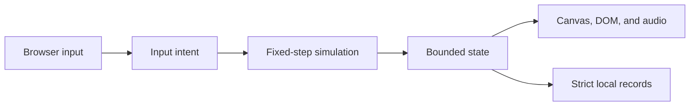

# Architecture

Neon Voyage is a static browser game built from one HTML document, one stylesheet, five deferred classic scripts, Canvas rendering, and Web Audio. It has no runtime package, module loader, server, network request, or build step.

## Startup and data flow

`index.html` loads scripts in this fixed order:

1. `js/config.js` creates the deeply frozen balance and stage configuration.
2. `js/core.js` exposes deterministic math, collision, storage, bounds, and collection utilities.
3. `js/audio.js` defines the capped optional Web Audio engine.
4. `js/render.js` defines authored scene data, checkpoint and Enigma previews, cached encounter washes, and the Canvas renderer.
5. `js/game.js` validates saved records, creates live state, binds input and UI, and starts the one animation loop.

Browser events write input intent. `js/game.js` consumes that intent in a 60 Hz fixed-step update with at most five catch-up steps per animation frame. Normal play uses the complete fixed delta. An Enigma draft deterministically tapers the simulation delta during its short slowdown and then supplies zero simulation time while the three-card choice is open. The renderer and accessible DOM continue presenting frames and status without advancing combat. Simulation state does not depend on render timing.

The renderer's CSS-space width and height come from the live `#game-shell` layout rectangle, including mobile browser-toolbar and `visualViewport` changes. Device-pixel ratio affects only the capped Canvas backing store. The renderer does not assign competing inline CSS dimensions from `window.innerWidth` or `window.innerHeight`.

## Source ownership

| Source | Owns | Does not own |
| --- | --- | --- |
| `index.html` | Semantic shell, Enigma and campaign dialogs, HUD, controls, CSP, script order | Gameplay behavior or styling |
| `styles.css` | Responsive upgrade cards, checkpoint summaries, overlays, touch presentation, focus, reduced-motion styling | Simulation state |
| `js/config.js` | Version, stages, milestone rewards, module tiers, pickup pacing, dimensions, timing, difficulty, caps | Mutable run state |
| `js/core.js` | Pure reusable deterministic utilities and safe storage primitives | Domain orchestration |
| `js/audio.js` | Optional material/weapon-specific synthesized cues, cooldowns, and active-node cap | Gameplay decisions |
| `js/render.js` | Scene keyframes, complete local scenery/gameplay asset loading, procedural fallbacks, previews, cached late/boss washes, field cues, telegraphs, and Canvas drawing | Progression or collision outcomes |
| `js/game.js` | Saved progress, modes, input, gated rewards, Enigma drafting, encounter and threat state machines, combat, progression, UI projection, frame loop | Authored balance values or raster provenance |
| `tests/` | Deterministic contracts and dependency-free browser simulation | Human game-feel acceptance |

Exact product behavior belongs in [`GAME_DESIGN.md`](GAME_DESIGN.md); exact tuning and caps belong in `js/config.js`.

## State and persistence

`js/game.js` owns one plain-object live state. Entity collections are mutated only through the fixed-step path and cleaned against the caps in `CONFIG.caps`. Encounter queues carry required, optional, descendant, carrier-lineage, and hard-cull-requeued threats until the field is truly clear. Permanent-module cadence, orbit contacts, player mines, shield recovery, pickup attraction, temporary-effect timers, asteroid hazards, alien attack phases, and boss reflection all advance only through the same fixed-step path. `state.upgradeDraft` owns the finite `idle` → `slowing` → `choosing` Enigma sequence, its deterministic choices, focus index, and time scale.

Stage handoff is one existing cinematic state with two explicit phases. `clear` holds the completed encounter for `CONFIG.cinematic.clearHoldSeconds`, keeps input and combat neutral, and advances/cleans only the already bounded final effects and floaters. `travel` then runs the unchanged `CONFIG.cinematic.duration` hyperspace motion, scene crossfade, screen-anchor preservation, and final `advanceEncounter()` handoff. Encounter numbers, combat collections, random progression, and rewards cannot advance during the clear hold.

Lethal damage sets logical `gameover` mode immediately so same-step collision, reward, score, checkpoint, and input guards remain terminal. `state.presentation.gameoverPending` delays only the DOM projection: the HUD remains visible, the game-over overlay stays inert and unfocused, and a capped frame-time presentation path advances existing death particles plus shake/flash decay for `CONFIG.presentation.gameoverEffectDuration`. No world, projectile, pickup, director, audio cadence, or random state advances. When the timer reaches zero, the overlay becomes active and its primary action receives focus.

Reward eligibility has one runtime path. `progressionStage()` selects the current authored stage and treats later sectors as the final band; `currentDropBand()` selects one of the six frozen configuration bands; `contentUnlocked()` applies stage gates; and `rewardableModuleIds()` intersects the unlocked catalog with the band's tier ceiling. Natural drops, Enigma permanent cards, module caches, milestones, and boss cores use those boundaries rather than maintaining separate hidden catalogs.

Threat counterplay is similarly state-owned and config-driven. Auric descendants retain their explosive/magnetic variant and split generation through requeues. Corona hazards retain cooldown/warning/active timers and beam angle. Gunships own warning/active/cooldown laser state. Brood Carriers retain their living-child lineage across requeues. Mixed-kind wave groups build a seeded balanced bag without changing their authored count or the number of random draws. The configured `bossType` selects Harrower or Leviathan behavior; both reuse the responsive combat-field geometry, and the Leviathan's reflection object remains active only while shield nodes survive.

Two strict local-storage records are intentionally separate:

| Key | Contents | Compatibility rule |
| --- | --- | --- |
| `neon-voyage-v1` | High score and sound/effects preferences | Keep the key and strict validation |
| `neon-voyage-progress-v1` | Schema-3 unlocked stages, 20 bounded checkpoints, 13 Mk V module tiers, and up to four base durations for each of seven saved temporary effects | Preserve tested exact-shape migrations from schema 2 and schema 1 |

The storage key remains unchanged. Schema 3 accepts only the exact current module and timer keys, Stage 1–20 bounds, Mk I–V tiers, four-duration timer ceilings, and a 16,384-byte record limit. A valid schema-2 record retains its exact legacy seven-module/five-timer shape and Stage 1–9 bounds during migration; valid schema-1 unlock progress is migrated separately. New keys are filled with safe zero values, while malformed, unknown, oversized, or out-of-range records are rejected rather than partially trusted. Live hull, score, position, clocks, cooldown phase, entities, generated Enigma cards, and paused battles are never saved as campaign checkpoints.

Collecting Enigma generates three seeded, non-duplicated eligible choices before slowdown begins. A band may decline to offer a permanent card, so temporary and support choices provide bounded fallbacks. Unscaled draft elapsed time advances by the fixed step, while its smooth time scale multiplies only gameplay simulation. At the `choosing` phase the multiplier is zero, transient controls remain neutral, the modal owns focus, and selection applies exactly one upgrade before restoring input with bounded invulnerability and checkpointing the result. The existing animation frame calls `ND.EnigmaPreview.render` for each decorative card canvas; the preview owns no random source, event listener, or animation loop.

The HUD remains a projection of live state. Shield reserve is hidden at zero and exposes the configured 60-point maximum when charged. Desktop rows expose equipped systems and individual timed countdowns; compact touch CSS displays one accessible summary per row and makes both rows pointer-transparent so they cannot intercept movement or aim starts. Touch-stick bases move only by drag overshoot while retaining their original pointer-ID role; shared Dash and Pulse readiness predicates gate both simulation input and the accessible touch-button projection.

The right touch stick has one finite gesture state. It starts pending at neutral, becomes auto-aim only after `CONFIG.mobileControls.autoAimHoldSeconds`, and retains one target until that target is no longer actionable. It then reuses the bounded nearest-target scan to reacquire. Any shaped manual deflection latches manual aim until the matching release/cancel/cleanup; returning to center cannot re-enter auto-aim in the same gesture. The auto-aim eligibility predicate excludes either command-ship body while live nodes reduce its damage, but leaves those nodes and other threats eligible; Leviathan reflection remains a separate node-dependent defense. Every existing pointer-capture, pause, orientation, visibility, page-lifecycle, and mode cleanup clears the timer, latch, target, and fire intent together. Mouse, keyboard, and gamepad paths do not read this gesture state.

`js/render.js` loads repository-local scenery plus 46 realistic gameplay WebPs through one bounded image cache. Immutable maps select art for every asteroid variant, alien class, boss/node, projectile family, mine, pickup chassis, drone, blade, and material effect. Pending or failed images retain established procedural paths. Live telegraphs, shields, crack stages, hazard pulses, pickup symbols, field ranges, and targeting cues stay code-drawn because they project gameplay state rather than static object art. Draw sizing and presentation-only impact sprites add no simulation random draws, unbounded collections, network access, or persistence changes. Stars and encounter gradients are rebuilt only when the shell-owned renderer size changes. Late-stage intensity derives from encounter progression, boss washes derive from configured `bossType`, and both crossfade with the same scene-handoff weights. Reduced effects use lower static opacity. Tractor arcs read the exact equipped-tier range; subtle field cues read the shared combat-field bounds; telegraphs read the runtime warning/active objects; and Leviathan reflection reads the node-dependent shield object defensively. The cyan/magenta reticle draws only when `js/game.js` projects active mouse/pen pointer aim; touch and neutral aim do not render it, and a later pointer move can restore it on a hybrid device.

`js/audio.js` remains an optional, locally synthesized Web Audio layer. Fixed cue families distinguish player modules, hostile sources, material impacts, scaled destruction, pickups, movement, bosses, and ambient cadence. Cue-key cooldowns prevent burst spam, `activeNodes` never exceeds 24, every source disconnects on completion, and browser refusal to create or resume an audio context remains harmless. Audio does not load files, allocate per-frame oscillators, or affect deterministic simulation decisions.

## Large-file routing

`js/game.js` is deliberately the orchestration owner. Inspect the connected region and its tests before changing it:

| Responsibility | Main functions or state |
| --- | --- |
| Save compatibility | `validSave`, strict schema-3 checkpoint/progress validators, schema-2/schema-1 migration, `saveLocal`, `saveProgress` |
| Modes and UI ownership | overlay/dialog helpers, delayed game-over projection/focus, Enigma card/preview/focus flow, run start/restart/menu flow, progress grid, shield readout, equipped-module strip, timed-effect countdowns, and compact summaries |
| Input lifecycle | keyboard, pointer-only reticle intent, pending/manual/auto touch-aim gesture, gamepad, orientation, visibility cleanup |
| Encounter lifecycle | combat-field setup, queues, waves, clear/travel cinematic phases, stage advancement |
| Combat | ship/weapons, passive cadence/ranges, spawns, evolved hazard and alien state machines, shared boss fields/reflection, collisions, damage, gated pickups, temporary stacking, and bounded module rewards |
| Bounded cleanup | effects, hard-cull requeue, collection cleanup, camera, origin rebasing |
| Verification surface | `ND.game`, deterministic debug controls, snapshot, fixed-step `frame` loop |

`js/render.js` similarly owns both scene composition and draw routines; its stable test surfaces are `ND.StagePreview`, `ND.EnigmaPreview`, and `ND.RenderDebug`. Split either large file only when a small explicit interface creates clearer ownership and all affected tests can move with it.

## Security and hosting boundaries

- All runtime resources are repository-local relative paths so direct-file and `/Neon-Voyage/` Pages hosting both work.
- The CSP rejects network connections, frames, workers, forms, remote code, and dynamic code.
- The Pages workflow verifies and uploads the repository root without transforming runtime files.
- Audio unlock, fullscreen, orientation lock, local storage, and pointer capture may fail; their failure paths must remain safe.

See [`SECURITY.md`](../SECURITY.md) for reporting scope.

## Verification surfaces

- `ND.Core` exposes pure utility contracts.
- `ND.RenderDebug` exposes scene, cinematic, anchor, damage, scenery-source, and complete gameplay-asset-source contracts.
- `ND.StagePreview.render` exposes deterministic checkpoint-card rendering.
- `ND.EnigmaPreview.render` exposes deterministic, decorative choice-card rendering driven by the existing frame time and reduced-effects setting.
- `ND.game` exposes the intentional deterministic simulation surface used by tests, including both configured bosses, the Stage 1–20 journey, passive-system state, the Enigma snapshot, and controlled enhancement selection.

These are test seams, not a public third-party API. Preserve them when tests or compatibility rely on them; do not expand them merely to avoid testing behavior through its real owner.
